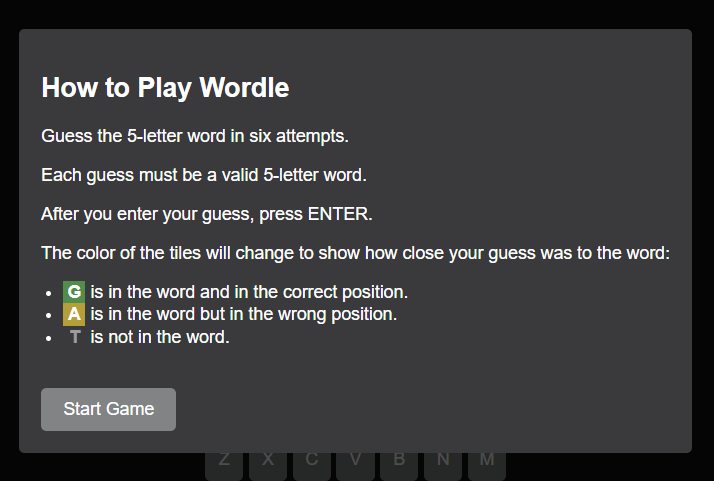

# Wordle Clone

A browser-based clone of the popular word game **Wordle**, built with **HTML**, **CSS**, and **JavaScript**. This project allows users to guess a randomly chosen 5-letter word in six attempts with helpful feedback to guide their guesses.


[Live Preview](https://dristanta-silwal.github.io/wordleClone/)


---

## 🚀 Features

- Fully responsive design for both desktop and mobile devices.
- Dynamic on-screen keyboard for mobile users.
- Visual feedback with color-coded tiles:
  - **Green**: Correct letter in the correct position.
  - **Yellow**: Correct letter in the wrong position.
  - **Gray**: Letter not in the word.
- Game rules displayed in a pop-up modal.
- Option to reset or play again after the game ends.
- Debugging support with the correct word displayed in the console (for development).

---

## 🎮 How to Play

1. Start the game by clicking the **"Start Game"** button.
2. Enter a valid 5-letter word using your keyboard or the on-screen keyboard.
3. Press **Enter** to submit your guess.
4. The tiles will change color to indicate how close your guess is:
   - **Green**: Correct letter in the correct position.
   - **Yellow**: Correct letter in the wrong position.
   - **Gray**: Letter is not in the word.
5. You have 6 attempts to guess the word. Good luck!

---

## 📂 Project Structure

```
wordle-clone/
│
├── index.html          # The main HTML file for the game
├── style.css           # CSS file for styling
├── index.js            # JavaScript file for game logic
├── README.md           # Project documentation
└── assets/             # Folder for images, screenshots, etc.
```

---

## 🛠️ Setup Instructions

Follow these steps to run the project locally:

1. Clone this repository:
   ```bash
   git clone https://github.com/dristanta-silwal/wordleClone.git
   ```

2. Navigate to the project directory:
   ```bash
   cd wordleClone
   ```

3. Open the `index.html` file in your browser:
   ```bash
   open index.html
   ```

4. Alternatively, host it on GitHub Pages for easy access:
   - Commit and push the code to your GitHub repository.
   - Go to the repository settings and enable GitHub Pages.
   - Access the game via your GitHub Pages URL.

---

## 📱 Responsive Design

The game is optimized for all devices, including mobile. On mobile devices:
- An **on-screen keyboard** is available for entering guesses.
- The layout adjusts to fit smaller screens.

---

## 📝 Development Notes

- The game uses a list of common 5-letter words stored in the `WORDS` array in the `index.js` file.
- The **debugging mode** prints the randomly chosen word in the console during development.

---

## 💡 Future Enhancements

- Add a timer or scoring system.
- Include a daily word challenge mode.
- Add animations for better user experience.
- Expand word list for more variety.

---

## 📄 License

This project is open-source and available under the [MIT License](LICENSE). Feel free to use, modify, and distribute this code for personal or commercial purposes.

---

## ✨ Credits

- Inspired by the original **Wordle** game by [Josh Wardle](https://www.nytimes.com/games/wordle/index.html).
- Re-Developed by [Dristanta Silwal](https://github.com/dristanta-silwal).

---

## 📷 Screenshots
